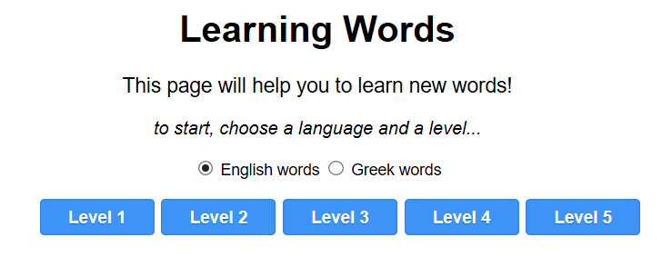
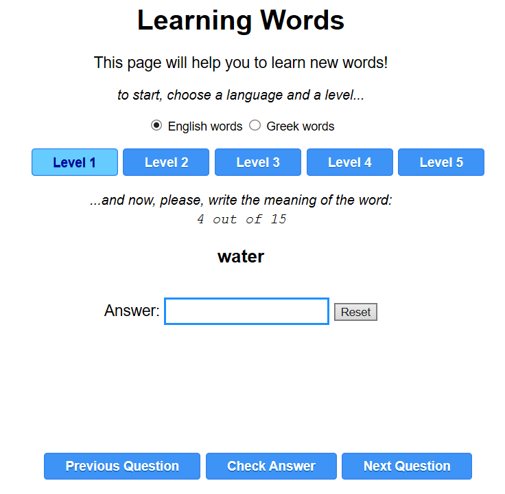
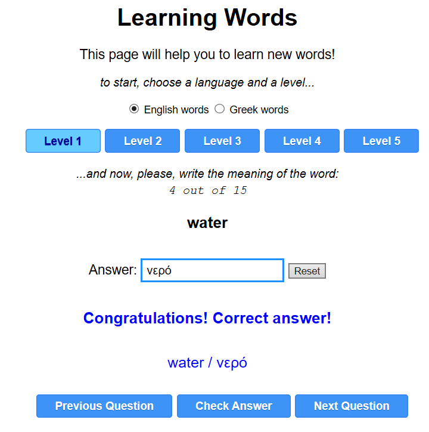

# Μαθαίνοντας καινούργιες λέξεις

## Εισαγωγή

Το πρόγραμμα αυτό είναι μία εφαρμογή web-app για να μας βοηθήσει να μάθουμε καινούργιες λέξεις. Αρχικά είναι ρυθμισμένο για να μας βοηθήσει να μάθουμε αγγλικές λέξεις αλλά μπορεί πολύ εύκολα, με μερικές μικρές αλλαγές που θα μπορούσαμε να κάνουμε ακόμη και μόνοι μας, να μας βοηθήσει να μάθουμε καινούργιες λέξεις σε οποιαδήποτε γλώσσα.

## Τι είναι μία εφαρμογή web-app

Οι εφαρμογές web-app είναι εφαρμογές που λειτουργούν μέσω των browsers (π.χ. Google Chrome, Firefox, Microsoft Edge, Opera κ.τ.λ.) χωρίς να χρειάζεται να γίνει εγκατάσταση τους.

Το πλεονέκτημα τους είναι ότι λειτουργούν σε όλους τους υπολογιστές, σε όλα τα tablet (Android και iPad) και σε όλα τα smartphones (Android και iPhone).

## Οδηγίες χρήσης

Για να χρησιμοποιήσετε την εφαρμογή, κάντε κλικ στον ακόλουθο σύνδεσμο:

https://learn-words.github.io/words-1/

Παρότι η εφαρμογή έχει τη δυνατότητα να λειτουργήσει σε όλες τις προαναφερόμενες συσκευές, απαιτείται πρώτα να υπάρξουν εκτενείς δοκιμές και διορθώσεις για την σωστή λειτουργία της.

Στην προκειμένη περίπτωση, η εφαρμογή έχει δοκιμαστεί μόνον για υπολογιστές (όλοι οι browsers) και για tablet και smartphone Android (χρησιμοποιώντας τον browser Google Chrome).

Αφού εμφανιστεί η εφαρμογή στην οθόνη (στην οθόνη των smartphone η εφαρμογή προσαρμόζεται διαφορετικά όταν το τηλέφωνο είναι σε κατακόρυφη θέση και διαφορετικά όταν είναι σε οριζόντια θέση) διαλέγουμε ένα από τα επίπεδα 1 έως 5 (Level 1 έως Level 5) και τότε εμφανίζεται η πρώτη λέξη για την οποία θα πρέπει να απαντήσουμε ποιά είναι η μετάφραση της.

Εάν έχουμε επιλέξει "English words" τότε θα εμφανιστεί μία αγγλική λέξη, ενώ αν διαλέξουμε την επιλογή "Greek words" τότε θα εμφανιστεί μία ελληνική λέξη και θα πρέπει να πληκτρολογήσουμε την ερμηνεία της στα αγγλικά.

Στη συνέχεια, αφού γράψουμε την λέξη πατάμε "Check Answer" και βλέπουμε εάν η απάντηση που δώσαμε είναι σωστή ή όχι, ενώ ταυτόχρονα θα δούμε και την σωστή απάντηση.

Επάνω από την λέξη που εμφανίζεται κάθε φορά, υπάρχουν αριθμοί που δείχνουν τον αύξοντα αριθμό της τρέχουσας λέξης καθώς και το σύνολο των λέξεων που περιλαμβάνονται στο συγκεκριμένο επίπεδο (Level).

Για να προχωρήσουμε στην επόμενη λέξη πατάμε είτε την επιλογή "Next Question" είτε το δεξί πλήκτρο στο πληκτρολόγιο του υπολογιστή.

Ομοίως εάν θέλουμε να δούμε την προηγούμενη λέξη, ενώ εάν βρισκόμαστε στην πρώτη λέξη που εμφανίζεται, πατώντας το "Previous Question" βλέπουμε μία σύντομη περιγραφή για την κατηγορία των λέξεων που περιλαμβλάνονται στο συγκεκριμένο επίπεδο (Level).

Θα πρέπει ακόμη να τονιστεί ότι κάθε φορά που πατάμε ένα από τα "Level 1" έως "Level 5" ότι οι λέξεις που περιλαμβάνονται σε αυτό το επίπεδο (Level) τυχαιοποιούνται κι έτσι κάθε φορά εμφανίζονται με διαφορετική σειρά.

Επίσης, όταν γράφουμε μία απάντηση, εκτός από την επιλογή "Check Anser" μπορούμε επίσης να πατήσουμε το πλήκτρο enter στον υπολογιστή για να δούμε εάν απαντήσαμε σωστά (την σωστή απάντηση μπορούμε να την δούμε ακόμη κι αν δεν γράψουμε κάτι στο πεδίο της απάντησης).

Προσοχή όμως γιατί θα πρέπει να χρησιμοποιούμε τόνους όταν γράφουμε στα ελληνικά, ούτως ώστε να είναι σωστή η απάντηση που δίνουμε.  

## Προσαρμογή της εφαρμογής

Στην παρούσα έκδοση, η εφαρμογή περιλαμβάνει τα ακόλουθα πέντε σετ λέξεων:

* Level 1: Various words / Διάφορες λέξεις
* Level 2: Days & Months / Ημέρες & Μήνες
* Level 3: EU Countries / Χώρες ΕΕ
* Level 4: EU Languages / Γλώσσες ΕΕ
* Level 5: EU Capitals / Πρωτεύουσες ΕΕ

Σημείωση: Όλα τα ονόματα των κρατών, πρωτευουσών και γλωσσών, είναι τα επίσημα ονόματα της ΕΕ στην Αγγλική και στην Ελληνική γλώσσα, όπως ακριβώς εμφανίζονται στον επίσημο ισότοπο της ΕΕ:  

https://europa.eu/european-union/about-eu/countries/member-countries_en   
https://europa.eu/european-union/about-eu/countries/member-countries_el   

Υπάρχει επίσης η δυνατότητα προσαρμογής της εφαρμογής με λέξεις της προσωπικής μας επιλογής. Οι οδηγίες αυτές όμως θα αναφερθούν σε άλλο τμήμα, το οποίο θα περιλαμβάνει αναλυτικές πληροφορίες για την προσαρμογή της εφαρμογής στα δικά μας δεδομένα.
